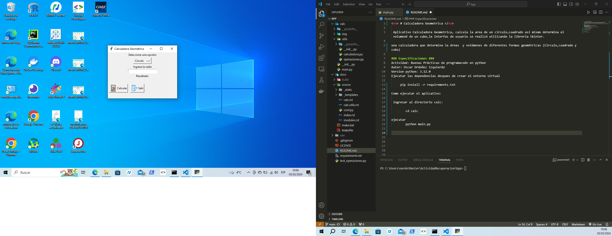

<em> # Calculadora Geometrica </em>

 Aplicativo Calculadora Geometrica, calcula la area de un circulo,cuadrado asi mismo determina el volumend de un cubo,la interfas de usuario se realizó utilizando la libreria tkinter.

una calculadora que determina la áreas  y volúmenes de diferentes formas geométricas (Circulo,cuadrado y cubo)

### Especificaciones ###
Actividad: Buenas Prácticas de programacoón en python
Autor: Oscar Ordoñez Izquierdo
Version python: 3.12.0
Ejecutar las dependencias despues de crear el entorno virtual

     pip install -r requirements.txt 

### Como ejecutar el aplicativo: ###

  1.- Utilizar git clone 

  2.- Ingresar al directorio calc:
    
        cd calc

  3.- Ejecutar
        python main.py

        

